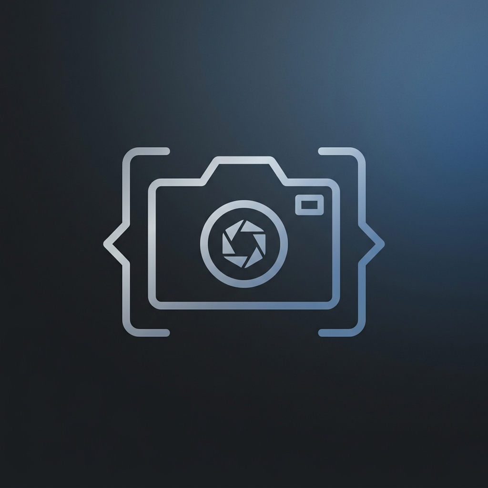

# MyCodeSnap

<div align="center">
  
</div>

<p align="center">
  <strong>The fastest way for developers to make technical content look intentional.</strong>
</p>

MyCodeSnap (formerly DevPost Studio / CodeDiff) is an advanced canvas platform designed for composing and exporting beautiful technical visuals. It turns raw developer artifacts—code snippets, git diffs, terminal sessions, API payloads, and database schemas—into polished, high-fidelity images ready to be shared on social media, blogs, or team documentation.

## ✨ Features

- **Code Snapshots:** Create stunning, syntax-highlighted code images with beautiful backgrounds.
- **Git Diffs:** Showcase code changes with a clean, professional diff viewer.
- **Terminal Simulator:** Render terminal commands and outputs with authentic aesthetics.
- **API Response Viewer:** Visualize JSON payloads and HTTP requests effortlessly.
- **Database Schema Designer:** Document and share database architecture visually.
- **Architecture Canvas:** An infinite, interactive workspace (node-based) to compose complex technical diagrams and workflows.
- **High-Quality Export:** Export your creations seamlessly to PNG, JPG, or SVG using a custom built export engine optimized for infinite canvas layouts.

## 🛠️ Technology Stack

- **Framework:** React + Vite
- **Language:** TypeScript
- **Styling:** TailwindCSS
- **Animations:** Framer Motion
- **State Management:** Zustand
- **Icons:** Lucide React

## 🚀 Getting Started

To run MyCodeSnap locally, follow these steps:

1. **Clone the repository:**
   ```bash
   git clone https://github.com/Sachinn-p/MyCodeSnap.git
   cd MyCodeSnap
   ```

2. **Install dependencies:**
   ```bash
   npm install
   ```

3. **Start the development server:**
   ```bash
   npm run dev
   ```

4. Open your browser and navigate to the local URL provided by Vite (usually `http://localhost:5173`).

## 🎨 Design Philosophy

Easy, elegant, efficient. The tool is built by developers, for developers, with opinionated defaults and zero friction. The UI is designed to get out of your way so that your technical content remains the hero.

## 📝 License

MIT
